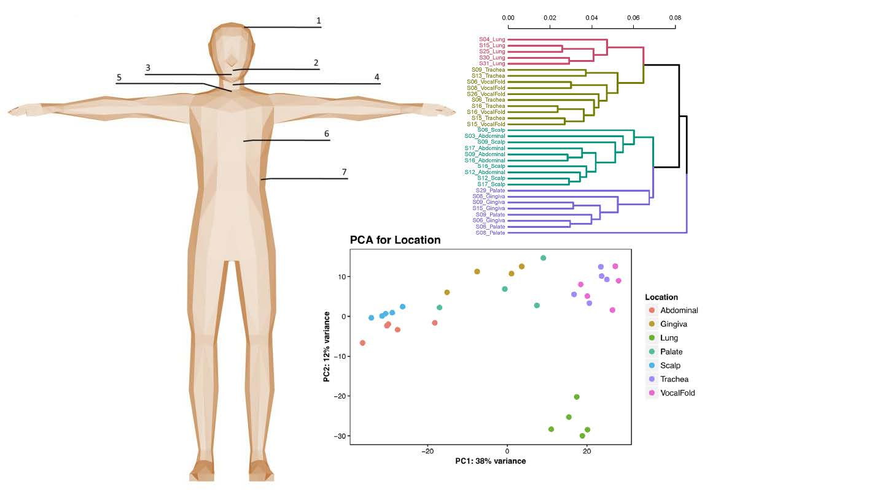
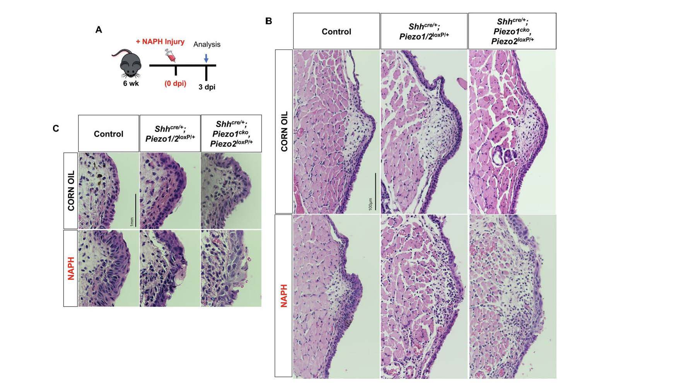
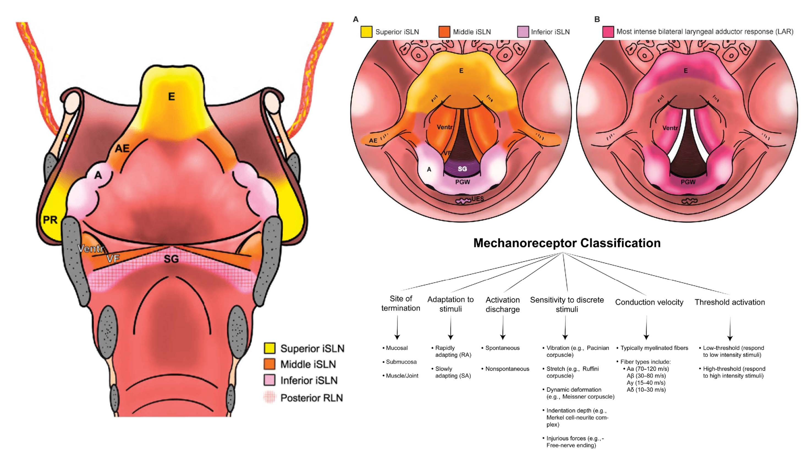

# Clinician-Scientist

## Education
- Ph.D. CSD & Biomedical Engineering | University of Wisconsin-Madison (_2017-2022_)	
- M.A., Speech-Language Pathology | State University of New York at Buffalo (_2012-2015_)
- B.A., Business Management & Administration | West Virginia University (_2004-2008_)

## Work Experience
**NIH F32 Postdoctoral Research Fellow @ UC-San Diego (_08/2022-present_)**
- Leveraging genomic approaches to uncover neuroimmune mechanisms regulating airway repair in post-viral disease setting

**LLM Designer | Biology Division @ OpenAI (_2024--contract_)**
- Utilized my domain expertise to create high-quality human-derived training datasets (Project: Lion, Elephant) of tasks that were used to evaluate OpenAI LLMs

**NIH F31 Predoctoral Research Fellow @ UW-Madison (_2017-2022_)**
- Investigated the role of Piezo1/Piezo2 mechanoreceptors in airway epithelial regeneration and repair

**Research Associate @ UW-Madison (_2015-2017_)**
- Employed bulk RNA-seq for transcriptomic profiling of human fibroblasts

**Medical Speech-Language Pathologist @ UW Hospital & Clinics (_2015-2017_)**
- Specialized in the assessment and treatment of patients with organic, neurological,and functional voice/swallow disorders, and upper airway dysfunction

**Clinical Graduate Research Trainee @ SUNY University at Buffalo (_2013-2015_)**
- Conducted clinical study on lifestyle health, self-perceived voice quality, and acoustic parameters in professional voice users

## Projects
### Neuroimmune interactions for laryngeal sensorimotor neuropathy in postviral influenza infection
[Funding Award](https://reporter.nih.gov/search/NzhijxcIoE-2-uPq0CEwkQ/project-details/10922743)

My current research is guided by the hypothesis that viral infection of the larynx activates neurosensory cells, remodels both afferent and efferent nerves, and contributes to mucosal inflammation and hypersensitivity. To test this hypothesis, I employ an established mouse model of influenza A virus (IAV) infection to interrogate laryngeal mucosal remodeling and map afferent/efferent neural circuits/cells in naïve and virus-infected tissues.

### A Single-Cell Atlas of the Upper Respiratory Epithelium Reveals Heterogeneity in Cell Types and Patterning Strategies
[Publication](https://www.biorxiv.org/content/10.1101/2025.01.16.633456v1)

Mucosal surfaces lined by epithelial cells are essential elements of the respiratory tract, effective not only as a first-line physical barrier against chronic external threats, but also for host immune defense, and injury repair. Here, using **single cell RNAseq** combined with spatial validation, we present a comprehensive atlas of the mouse upper respiratory epithelium. This work serves as a valuable atlas for hypothesis-driven work into responses to environmental insults, genetic mutations, and infectious diseases.

### Tissue specific human fibroblast differential expression based on RNAsequencing analysis
[Publication](https://link.springer.com/article/10.1186/s12864-019-5682-5)

Physical forces, such as mechanical stress, are essential for tissue homeostasis and influence gene expression of cells. In particular, the fibroblast has demonstrated sensitivity to extracellular matrices with assumed adaptation upon various mechanical loads. The purpose of this study was to compare the vocal fold fibroblast genotype, known for its unique mechanically stressful tissue environment, with cellular counterparts at various other anatomic locales to identify differences in functional gene expression profiles. By using **bulk RNA-seq** technology, we identified differentially expressed gene programs (DEseq2) among seven normal human fibroblast primary cell lines from healthy cadavers, which included: vocal fold, trachea, lung, abdomen, scalp, upper gingiva, and soft palate.

### _Piezo1_-expressing vocal fold epithelia modulate remodeling via effects on self-renewal and cytokeratin differentiation
[Publication](https://link.springer.com/article/10.1007/s00018-022-04622-6)

Mechanoreceptors are implicated as functional afferents within mucosa of the airways and the recent discovery of mechanosensitive channels _Piezo1_ and _Piezo2_ has proved essential for cells of various mechanically sensitive tissues. However, the role for _Piezo1/2 _ in vocal fold (VF) mucosal epithelia, a cell that withstands excessive biomechanical insult, remains unknown. The purpose of this study was to test the hypothesis that _Piezo1_ is required for VF mucosal repair pathways of epithelial cell injury. Utilizing cell-based assays within genetically-engineered murine tissue, we demonstrated a role for _Piezo1_-expressing VF epithelia in regulating self-renewal via effects on _p63_ transcription and YAP subcellular translocation—altering cytokeratin differentiation.

### Sensory innervation of the larynx and the search for mucosal mechanoreceptors
[Publication](https://pubs.asha.org/doi/abs/10.1044/2020_JSLHR-20-00350)

This review article improved understanding of iSLN innervation and corresponding mechanotransduction events to help shed light upon a variety of pathological reflex responses, including persistent cough, dysphonia, and laryngospasm.

[Full Publication Record](https://scholar.google.com/citations?user=HBHi-44AAAAJ&hl=en)
